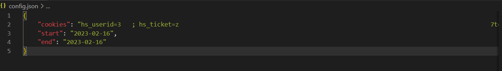

# treinposities
exporter voor je ritten in mijn ritten van treinposities.

## Gebruik
Voer in config.json je persoonlijke inlog cookie in. Deze kan je vinden door naar [treinposities.nl]() te gaan.

je kan je cookies vinden door binnen de developer tools naar het tabje ``network``/``netwerk`` te gaan, de pagina te herladen en op het eerst geladen HTML bestand te klikken. In de rechterbalk kan je nu onder het tabje ``headers`` scrollen tot je onder de request headers ``cookies`` tegenkomt.

Gebruik je Firefox, dan kan je je cookies kant en klaar hieruit kopiëren en in het config bestand plakken.

Gebruik je Chrome of een andere chromium browser dan moet je alleen de ``hs_userid`` en de ``hs_ticket`` kopiëren. Plak het stukje tekst wat je hier vindt in de config file en je bent klaar!

In het config bestand moet je ook een begin en einddatum (yyyy-mm-dd) invoeren, deze zijn beiden inclusief.

Omdat treinposities geen API levert kijkt dit script voor elke dag tussen de begin en einddatum of er ritten in staan door de volledige pagina te downloaden. Om het hele proces sneller te laten verlopen raad ik daarom aan "clusters" per keer te selecteren, op die manier hoef je niet te wachten op bijvoorbeeld een maand waarin je niet met de trein hebt gereist en dus alleen maar lege pagina's aan het downloaden bent. De begin en einddatum werkt ook met dezelfde begin en einddatum, dan wordt alleen die ene dag gescrapet.

## Transformer
Mocht je deze data in Excel willen gebruiken dan is de standaard output van index.mjs misschien niet het handigste. transformer.js zet de Array->Obejct structuur om tot een 2d array structuur die makkelijker door Excel ingeladen kan worden.